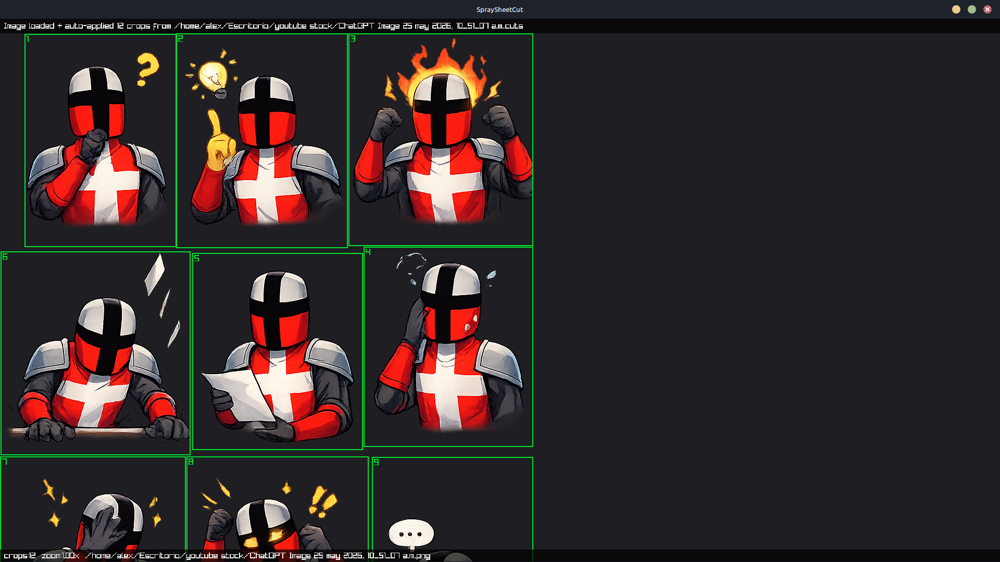
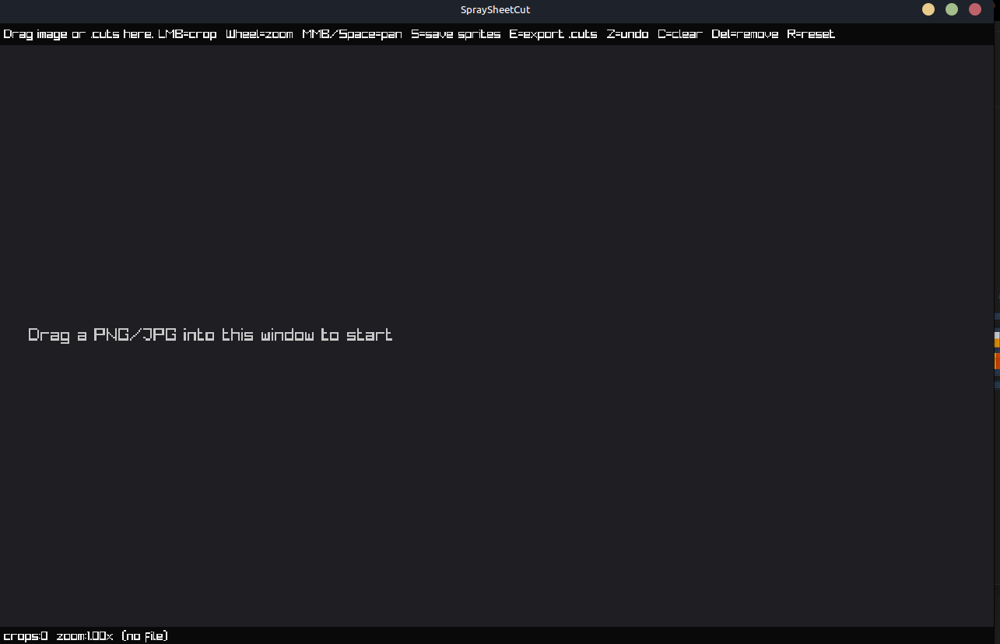

<p align="center">
  
</p>

<h1 align="center">SpraySheetCut</h1>

<p align="center">
  <em>A lightweight manual sprite sheet cutter for imperfect grids. Draw boxes, save numbered PNGs, reuse layouts across sheets.</em>
</p>

<p align="center">
  
</p>

## Why it exists

Sprite sheets generated by AI, ripped from old animations, or grabbed from random asset packs rarely line up on a clean grid. Automatic slicers fail on these. SpraySheetCut is intentionally manual: **you** decide where each sprite is, frame by frame, with the mouse. Then it exports each region as a numbered PNG.

It's a small, one-purpose tool. Nothing fancy. Useful when you need it.

## Features

- Load PNG / JPG via drag and drop or command-line argument.
- Draw rectangles by dragging the mouse. No fixed grid, no fixed size.
- Zoom with the mouse wheel, pan with middle mouse or `Space + left click`.
- Select a crop and delete it with `Del`. Undo with `Z`. Clear all with `C`.
- Save all crops as numbered PNGs (`sprite_001.png`, `sprite_002.png`, ...) in an `output/` folder next to the source image.
- Export the layout to a `.cuts` file. Drag that file onto another image to reuse the same crops.
- If you load an image and a sibling `<image>.cuts` file exists, it is applied automatically.

## Screenshots

| Empty state | With crops drawn |
|---|---|
|  |  |

## Requirements

- Linux (tested on Linux Mint / Ubuntu).
- `g++`, `make`, `git`, `cmake`.
- raylib 5.x (the `install_raylib.sh` script installs it for you).

## Installation

```bash
git clone https://github.com/<your-user>/spraysheetcut.git
cd spraysheetcut
./install_raylib.sh   # first time only. Requires sudo.
./build.sh
```

This produces a `./spraysheetcut` binary in the project folder.

## Usage

```bash
./spraysheetcut                       # start empty, drag an image in
./spraysheetcut spritesheet.png       # start with image loaded
```

### Controls

| Key / action | What it does |
|---|---|
| Drag image into window | Load image |
| Drag `.cuts` into window | Apply saved layout |
| Left click + drag | Create a rectangular crop |
| Left click on a crop | Select it (turns yellow) |
| Mouse wheel | Zoom (centered on cursor) |
| Middle mouse button | Pan |
| `Space` + left click | Alternate pan |
| `R` | Reset view (zoom 1x, centered) |
| `Z` | Undo last crop |
| `Del` | Delete selected crop |
| `C` | Clear all crops |
| `E` | Export layout as `<image>.cuts` |
| `S` | Save all crops as PNG files |

### Output

When you press `S`, crops are exported to an `output/` folder **next to the loaded image**:

```
my_folder/
├── spritesheet.png
└── output/
    ├── sprite_001.png
    ├── sprite_002.png
    └── ...
```

Numbering follows the order in which you drew the rectangles.

## The `.cuts` format

Plain text, hand-editable. Each line is one rectangle in pixels of the original image:

```
# spraysheetcut layout v1
12 34 64 64
80 34 64 64
148 34 64 64
```

Columns: `x y width height`. Lines starting with `#` are comments.

## Recommended workflow for reusing layouts

1. Load `character_run.png`.
2. Mark the frames with the mouse.
3. Press `E` → creates `character_run.cuts`.
4. Load `character_idle.png` (same grid).
5. Drag `character_run.cuts` into the window → same crops applied.
6. Press `S` → exports the PNGs.

## Known limitations

- No resize / move for existing crops. If you made a mistake, delete and redraw it.
- No file picker dialog: use drag-and-drop or the command-line argument.
- Tested only on Linux. Should compile on other systems with raylib but it's not verified.

## Contributing

Issues and PRs welcome. The codebase is a single `main.cpp` file under 300 lines, kept deliberately small.

## License

MIT.
